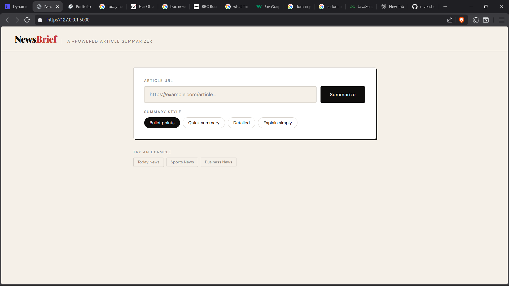
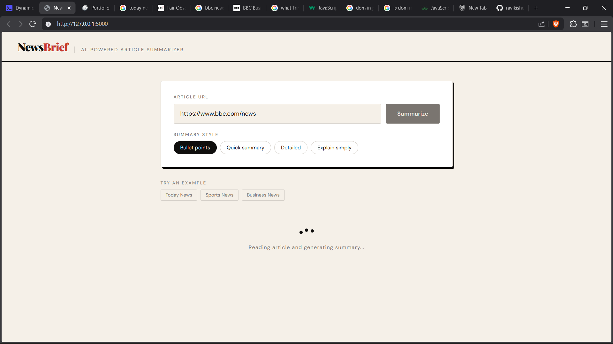
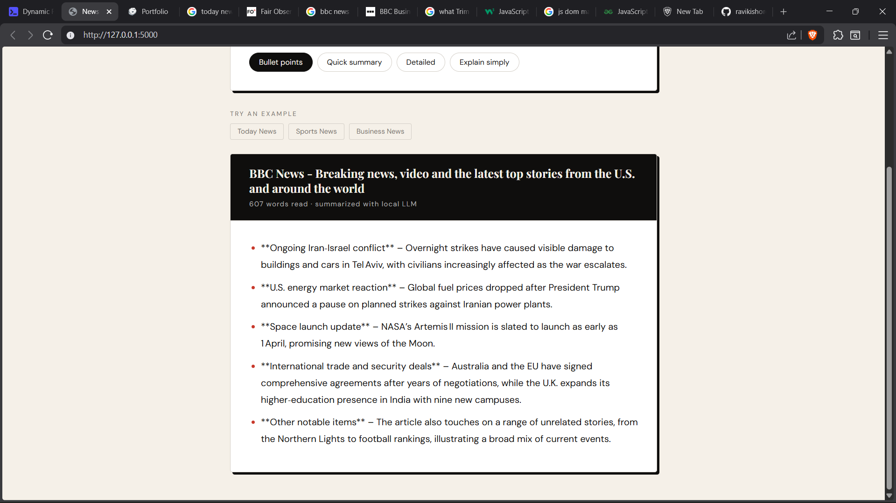

# NewsBrief — AI News Summarizer

A web app that scrapes any news article or webpage and summarizes it using AI — supports both **cloud deployment with Ollama free API** and **local LLM via Ollama** on your own machine.

🌐 **Live Demo**: [your-app.onrender.com](https://news-summarizer-p5pg.onrender.com/)

---

## Screenshots

**Home — paste any article URL**


**Loading — AI-Generating summary**



**Result — AI-generated summary**



---

## Features

- Paste any news/article URL and get an instant summary
- 4 summary styles — bullet points, quick, detailed, explain simply
- Supports Ollama free API (cloud) or local LLM (your machine)
- Clean newspaper-style UI
- Works with Wikipedia, news sites, blogs, and more

---

## Tech Stack

- **Backend** — Python, Flask, Gunicorn
- **Scraping** — requests, BeautifulSoup4
- **LLM** — Ollama API (cloud) or local Ollama model
- **Frontend** — HTML, CSS, vanilla JavaScript
- **Hosting** — Render

---

## Two Ways to Run

### Approach 1 — Hosted on Render (Ollama free API)

The live demo uses Ollama's free cloud API — no local model needed, works from any device.

```env
OPENAI_API_KEY=your-ollama-api-key
OPENAI_BASE_URL=https://api.ollama.ai/v1
MODEL_NAME=gpt-oss-20b-cloud
```

Get your free Ollama API key at [ollama.com](https://ollama.com)

---

### Approach 2 — Run Locally (your own machine, 100% free)

Run the app on your own machine using a locally installed Ollama model — no internet needed, completely private.

```env
OPENAI_API_KEY=ollama
OPENAI_BASE_URL=http://localhost:11434/v1
MODEL_NAME=gpt-oss-safeguard:20b
```

---

## Setup — Local

### 1. Clone the repo

```bash
git clone https://github.com/yourusername/news-summarizer.git
cd news-summarizer
```

### 2. Install dependencies

```bash
# Using uv (recommended)
uv init
uv add flask requests beautifulsoup4 openai python-dotenv gunicorn

# Or using pip
pip install -r requirements.txt
```

### 3. Configure .env for local

Create a `.env` file:

```env
OPENAI_API_KEY=ollama
OPENAI_BASE_URL=http://localhost:11434/v1
MODEL_NAME=gpt-oss-safeguard:20b
```

Replace `MODEL_NAME` with your model. Check yours with:

```bash
ollama list
```

### 4. Start Ollama

```bash
ollama run gpt-oss-safeguard:20b
```

### 5. Run the app

```bash
# Using uv
uv run main.py

# Or python
python main.py
```

Open `http://localhost:5000`

---

## Setup — Deploy to Render

### 1. Push code to GitHub

```bash
git add .
git commit -m "deploy to render"
git push
```

### 2. Create new Web Service on Render

```
Build command:  pip install -r requirements.txt
Start command:  gunicorn main:app
```

### 3. Add environment variables in Render dashboard

```
OPENAI_API_KEY  = your-ollama-api-key
OPENAI_BASE_URL = https://api.ollama.ai/v1
MODEL_NAME      = gpt-oss-20b-cloud
```

Render automatically handles Nginx, SSL, and HTTPS for you.

---

## Project Structure

```
news-summarizer/
├── main.py               # Flask backend + LLM integration
├── scraper.py            # Web scraping logic
├── .env                  # Environment variables (not committed)
├── requirements.txt      # Python dependencies
├── screenshots/          # App screenshots for README
└── templates/
    └── index.html        # Frontend UI
```

---

## How It Works

```
Browser → Flask → scraper.py scrapes article URL
                → cleaned text sent to LLM API
                → LLM generates summary
                → summary returned to browser
```

1. User pastes a URL and picks a summary style
2. Flask scrapes the page with `requests` + `BeautifulSoup`
3. Cleaned text is sent to LLM (cloud or local)
4. Summary is displayed in the browser

---

## Summary Styles

| Style          | Description                |
| -------------- | -------------------------- |
| Bullet points  | 5 clear bullet points      |
| Quick summary  | 2-3 sentence overview      |
| Detailed       | Full comprehensive summary |
| Explain simply | ELI5 — simple words only   |

---

## Example URLs to Try

- `https://en.wikipedia.org/wiki/Artificial_intelligence`
- `https://en.wikipedia.org/wiki/Python_(programming_language)`
- `https://en.wikipedia.org/wiki/Large_language_model`
- `https://www.bbc.com/news`

---

## Approach Comparison

|                   | Local Ollama       | Render + Ollama API     |
| ----------------- | ------------------ | ----------------------- |
| Cost              | Free               | Free (Ollama free tier) |
| Privacy           | 100% local         | Sent to Ollama API      |
| Internet needed   | No                 | Yes                     |
| Setup             | Install Ollama     | Push to GitHub          |
| Access from phone | No                 | Yes                     |
| Speed             | Depends on your PC | Fast                    |

---

## Contributing

Pull requests are welcome! For major changes please open an issue first.

---
